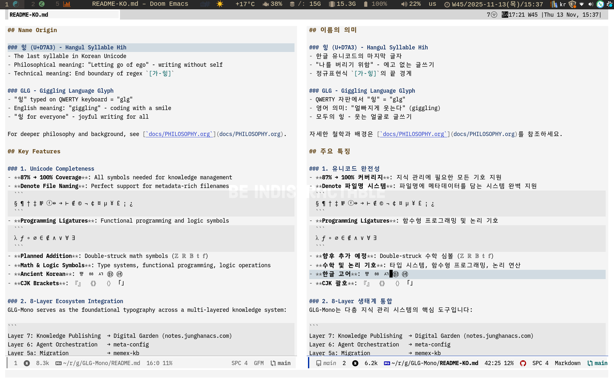

# GLG-Mono

[](https://github.com/junghan0611/GLG-Mono/releases)
[](https://opensource.org/licenses/OFL-1.1)
[](https://opensource.org/licenses/MIT)

> **Hih's Monospace Font for 8-Layer Ecosystem**
> **v1.0.0** - First stable release with complete Korean glyph bearing adjustment

GLG-Mono is a Korean programming font designed for knowledge management and AI collaboration. It merges IBM Plex Mono (English) with IBM Plex Sans KR (Korean) to provide comprehensive Unicode support in terminals and editors.

[한글 문서](README-KO.md) | [Philosophy](docs/PHILOSOPHY.org) | [Releases](https://github.com/junghan0611/GLG-Mono/releases)

## Name Origin

### 힣 (U+D7A3) - Hangul Syllable Hih
- The last syllable in Korean Unicode
- Philosophical meaning: "Letting go of ego" - writing without self
- Technical meaning: End boundary of regex `[가-힣]`

### GLG - Giggling Language Glyph
- "힣" typed on QWERTY keyboard = "glg"
- English meaning: "giggling" - coding with a smile
- "힣 for everyone" - joyful writing for all

For deeper philosophy and background, see [`docs/PHILOSOPHY.org`](docs/PHILOSOPHY.org).

## Screenshot



*GLG-Mono showcasing Korean glyph alignment, Nerd Fonts icons, and Unicode completeness in terminal environment*

## Key Features

### 1. Unicode Completeness
- **87% → 100% Coverage**: All symbols needed for knowledge management
- **Denote File Naming**: Perfect support for metadata-rich filenames
  ```
  § ¶ † ‡ № ⓕ ↔ → ⊢ ∉ © ¬ ¢ ¤ µ ¥ £ ¡ ¿
  ```
- **Programming Ligatures**: Functional programming and logic symbols
  ```
  λ ƒ ∘ ∅ ∈ ∉ ∧ ∨ ∀ ∃
  ```
- **Planned Addition**: Double-struck math symbols (ℤ ℝ 𝔹 𝕥 𝕗)
- **Math & Logic Symbols**: Type systems, functional programming, logic operations
- **Ancient Korean**: ㅹ ㆅ ㅺ ㉼ ㉽
- **CJK Brackets**: 『』 《》 〈〉 ｢｣

### 2. 8-Layer Ecosystem Integration
GLG-Mono serves as the foundational typography across a multi-layered knowledge system:

```
Layer 7: Knowledge Publishing  → Digital Garden (notes.junghanacs.com)
Layer 6: Agent Orchestration   → meta-config
Layer 5a: Migration            → memex-kb
Layer 5b: Life Timeline        → memacs-config
Layer 4: AI Memory             → claude-config (PARA + Denote)
Layer 3: Knowledge Management  → Org-mode 1,400+ files + Zotero 156k+ lines
Layer 2: Development           → doomemacs-config
Layer 1: Infrastructure        → nixos-config
```

Provides consistent typography across all layers with a single font.

### 3. TUI Terminal Optimization
- **Single-Font Completeness**: Terminals have limited font fallback (unlike Emacs)
- **AI Agent Collaboration**: Optimized for terminal-based AI tools (Claude Code, etc.)
- **Console Mode**: Half-width display for arrows and other symbols
- **Nerd Fonts Support**: Powerline symbols, devicons, and dev icons

### 4. Technical Differentiation (v1.0.0)
- **Korean Glyph Bearing Adjustment**: Precise center alignment after Nerd Fonts patching
  - IBM Plex Sans KR glyphs have actual width 892px (not 1000px)
  - Bbox-based center calculation: `offset = (target_width - actual_width) / 2 - bbox[0]`
  - Applied to both base fonts and Nerd Fonts variants
  - Prevents Korean glyph overlap in all rendering engines
- **Nerd Fonts Post-Processing**: Automatic bearing fix after FontPatcher merge
- **Web Font Support** (planned): WOFF2 format for Digital Garden integration
- **Complete Variant Set**: GLG-Mono, GLG-Mono35 (3:5 ratio)
- **8 Weights × 2 Styles**: Thin, ExtraLight, Light, Text, Regular, Medium, SemiBold, Bold
- **Nerd Fonts Variants**: All variants available with NF suffix

## Font Families (v1.0.0)

| Font Family | Width Ratio | Naming | Description |
|------------|-------------|--------|-------------|
| **GLG-Mono** | Half 1:Full 2 | `GLG-Mono-*.ttf` | Standard version (half-width: 528px, full-width: 1056px) |
| **GLG-MonoNF** | Half 1:Full 2 | `GLG-MonoNF-*.ttf` | With Nerd Fonts icons (Powerline, Devicons) |
| **GLG-Mono35** | Half 3:Full 5 | `GLG-Mono35-*.ttf` | Wider half-width (600px, full-width: 1000px) |
| **GLG-Mono35NF** | Half 3:Full 5 | `GLG-Mono35NF-*.ttf` | 3:5 ratio with Nerd Fonts |

### Variant Details
- **All variants** include Console mode optimization (half-width arrows/symbols)
- **NF suffix**: Adds 3,000+ Nerd Fonts glyphs with proper bearing alignment
- **16 fonts per family**: 8 weights (Thin ~ Bold) × 2 styles (Regular, Italic)
- **Total**: 64 fonts across all variants

### Font Selection Guide
- **Terminal use**: `GLG-MonoNF` (recommended for most users)
- **English-heavy code**: `GLG-Mono35NF` (wider half-width characters)
- **Without icons**: `GLG-Mono` or `GLG-Mono35` (smaller file size)

**Note**: "Console" is no longer part of the filename as all variants include console mode by default.

## Download & Installation

### Download from Releases

Visit the [Releases](https://github.com/junghan0611/GLG-Mono/releases) page and download your preferred variant:

**v1.0.0 Assets:**
- `GLG-Mono_v1.0.0.zip` - Standard fonts (GLG-Mono + GLG-Mono35, 32 fonts)
- `GLG-MonoNF_v1.0.0.zip` - With Nerd Fonts (GLG-MonoNF + GLG-Mono35NF, 32 fonts)
- `GLG-Mono_All_v1.0.0.zip` - Complete set (all 64 fonts)

**What's included in v1.0.0:**
- ✅ Korean glyph bearing adjustment (proper center alignment)
- ✅ Nerd Fonts post-processing (3,000+ icons with correct spacing)
- ✅ All weights and styles (Thin ~ Bold, Regular + Italic)
- ✅ Both width ratios (1:2 and 3:5)

### Installation

**Linux:**
```bash
mkdir -p ~/.local/share/fonts/GLG-Mono
unzip GLG-Mono_*.zip -d ~/.local/share/fonts/GLG-Mono
fc-cache -fv
```

**macOS:**
```bash
# Method 1: Double-click TTF files in Finder
# Method 2: Command line
cp *.ttf ~/Library/Fonts/
```

**Windows:**
1. Extract downloaded ZIP file
2. Select TTF files → Right-click → "Install"

## Building from Source

### Requirements
- Python 3.x
- FontForge (with Python bindings)
- Python packages: `fontTools`, `ttfautohint`
- Task (optional, recommended): https://taskfile.dev

### Build System

**For NixOS users:**
```bash
nix-shell  # Automatically loads all dependencies
```

**Using Taskfile (recommended):**
```bash
# Quick test builds (Regular weight only)
task quick              # 1:2 ratio
task quick:35           # 3:5 ratio
task quick:nerd         # Nerd Fonts

# Full builds (all weights)
task build              # Standard 1:2
task build:console      # Console mode
task build:nf           # Nerd Fonts
task build:console-nf35 # Console + 3:5 + Nerd Fonts

# Build + post-process (complete fonts)
task full               # Standard + 35
task full:all           # All variants
task full:nerd          # Nerd Fonts variants

# Utilities
task check              # List built fonts
task verify             # Verify Korean/Japanese glyphs
task clean              # Remove build directory
```

**Direct script execution:**
```bash
# Stage 1: FontForge (font merging)
python fontforge_script.py --debug --console --nerd-font

# Stage 2: FontTools (hinting & finalization)
python fonttools_script.py

# Check results
ls -lh build/GLG-Mono*.ttf
```

See `Taskfile.yml` for detailed build options.

## Project Lineage

```
IBM Plex (2017, IBM)
  ├─ IBM Plex Mono (English monospace)
  ├─ IBM Plex Sans JP (Japanese)
  └─ IBM Plex Sans KR (Korean)
    ↓
PlemolJP (2021, Yuko OTAWARA)
  - Japanese programming font
    ↓
PlemolKR (2024, soomtong)
  - Korean programming font
    ↓
GLG-Mono (2025, junghan0611)
  - Knowledge management & AI collaboration font
  - Unicode completeness
  - 8-Layer ecosystem integration
```

Thanks to all contributors.

## License

- **Font files**: SIL Open Font License 1.1
- **Build scripts**: MIT License

See [LICENSE](LICENSE) file for details.

## Related Links

- **Digital Garden**: https://notes.junghanacs.com (힣's Digital Garden)
- **Project Philosophy**: [docs/PHILOSOPHY.org](docs/PHILOSOPHY.org)
- **Build Guide**: [docs/BUILD.md](docs/BUILD.md) (coming soon)
- **PlemolJP**: https://github.com/yuru7/PlemolJP
- **PlemolKR**: https://github.com/soomtong/PlemolKR
- **IBM Plex**: https://github.com/IBM/plex

## Contributing

Issues and pull requests are always welcome.

See [`CLAUDE.md`](CLAUDE.md) for project philosophy and coding guidelines.

---

**"힣 for everyone"** - Code with a smile 🙂
