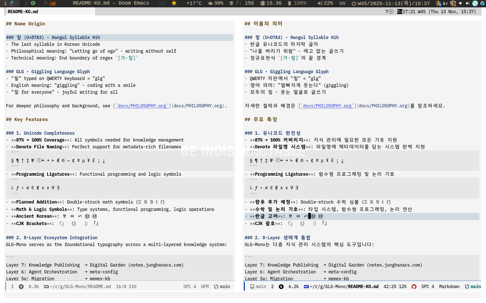

# GLG-Mono

[](https://opensource.org/licenses/OFL-1.1)
[](https://opensource.org/licenses/MIT)

> **Hih's Monospace Font for Knowledge Management & AI Collaboration**

GLG-Mono merges [IBM Plex Mono](https://github.com/IBM/plex) (English) with IBM Plex Sans KR (Korean) into a single monospace font with comprehensive Unicode coverage. Designed for terminals, editors, and the web.

[Philosophy](docs/PHILOSOPHY.org) · [Releases](https://github.com/junghan0611/GLG-Mono/releases)

## Name Origin

**힣 (U+D7A3)** — the last syllable in Korean Unicode. Philosophical meaning: "letting go of ego." Technical meaning: end boundary of `[가-힣]`.

**GLG** — "힣" typed on QWERTY keyboard. English meaning: "giggling" — coding with a smile.

## Screenshot



*GLG-Mono in terminal: Korean glyph alignment, Nerd Fonts icons, Unicode completeness*

## Font Families

| Family | Width Ratio | Description |
|--------|-------------|-------------|
| **GLG-Mono** | 1:2 (528:1056) | Standard monospace |
| **GLG-MonoNF** | 1:2 | + Nerd Fonts (3,000+ icons) |
| **GLG-Mono35** | 3:5 (600:1000) | Wider half-width characters |
| **GLG-Mono35NF** | 3:5 | Wider + Nerd Fonts |

Each family: **16 fonts** (8 weights × 2 styles). Total: **64 fonts**.

**Weights**: Thin, ExtraLight, Light, Text, Regular, Medium, SemiBold, Bold

### Which to Choose

- **Terminal**: `GLG-MonoNF` (recommended)
- **English-heavy code**: `GLG-Mono35NF` (wider Latin characters)
- **Minimal**: `GLG-Mono` (no Nerd Fonts, smaller file)
- **Web**: Use WOFF2 files from releases (see below)

## Download

### Desktop Fonts (TTF)

Download from [Releases](https://github.com/junghan0611/GLG-Mono/releases):

| Asset | Contents |
|-------|----------|
| `GLG-Mono_vX.X.X.zip` | GLG-Mono + GLG-Mono35 (32 TTF) |
| `GLG-MonoNF_vX.X.X.zip` | GLG-MonoNF + GLG-Mono35NF (32 TTF) |
| `GLG-Mono-WebFonts_vX.X.X.zip` | WOFF2 for web (Regular, Bold, Italic, BoldItalic) |

### Installation

```bash
# Linux
mkdir -p ~/.local/share/fonts/GLG-Mono
unzip GLG-Mono_*.zip -d ~/.local/share/fonts/GLG-Mono
fc-cache -fv

# macOS — double-click TTF files, or:
cp *.ttf ~/Library/Fonts/

# Windows — select TTF files → right-click → Install
```

## Web Fonts (WOFF2)

GLG-Mono is available as WOFF2 web fonts. Download from releases or use directly from GitHub:

### Self-Hosted

```html
<style>
  @font-face {
    font-family: 'GLG Mono';
    src: url('/fonts/GLG-Mono-Regular.woff2') format('woff2');
    font-weight: 400;
    font-style: normal;
    font-display: swap;
  }
  @font-face {
    font-family: 'GLG Mono';
    src: url('/fonts/GLG-Mono-Bold.woff2') format('woff2');
    font-weight: 700;
    font-style: normal;
    font-display: swap;
  }
  @font-face {
    font-family: 'GLG Mono';
    src: url('/fonts/GLG-Mono-Italic.woff2') format('woff2');
    font-weight: 400;
    font-style: italic;
    font-display: swap;
  }
  @font-face {
    font-family: 'GLG Mono';
    src: url('/fonts/GLG-Mono-BoldItalic.woff2') format('woff2');
    font-weight: 700;
    font-style: italic;
    font-display: swap;
  }

  body { font-family: 'GLG Mono', monospace; }
</style>
```

### From GitHub Releases (CDN)

```html
<!-- Replace vX.X.X with actual version -->
<style>
  @font-face {
    font-family: 'GLG Mono';
    src: url('https://github.com/junghan0611/GLG-Mono/releases/download/vX.X.X/GLG-Mono-Regular.woff2') format('woff2');
    font-weight: 400;
    font-style: normal;
    font-display: swap;
  }
</style>
```

### Web Font Files

| File | Size | Weight/Style |
|------|------|-------------|
| `GLG-Mono-Regular.woff2` | 2.6 MB | 400 Normal |
| `GLG-Mono-Bold.woff2` | 2.6 MB | 700 Normal |
| `GLG-Mono-Italic.woff2` | 2.8 MB | 400 Italic |
| `GLG-Mono-BoldItalic.woff2` | 2.8 MB | 700 Italic |

## Glyph Coverage Verification

WOFF2 conversion is **lossless** — Brotli compression only, no glyph data lost.

### TTF vs WOFF2 Comparison (GLG-Mono-Regular)

| Category | TTF | WOFF2 | Match |
|----------|-----|-------|-------|
| Total glyphs | 35,402 | 35,402 | ✅ |
| Mapped codepoints | 27,846 | 27,846 | ✅ |
| Hangul Syllables (AC00-D7AF) | 11,172 | 11,172 | ✅ Full |
| CJK Unified (4E00-9FFF) | 12,710 | 12,710 | ✅ |
| Kana / Bopomofo | 622 | 622 | ✅ |
| ASCII (0-7F) | 97 | 97 | ✅ |
| Latin Extended | 295 | 295 | ✅ |
| Greek / Cyrillic | 289 | 289 | ✅ |
| SMP (10000+) | 391 | 391 | ✅ |
| Font tables | 19 | 19 | ✅ All preserved |
| **힣 (U+D7A3)** | ✅ | ✅ | ✅ |
| **Difference** | — | — | **0 codepoints** |

File size: 7.5 MB (TTF) → 2.6 MB (WOFF2) = **65% reduction**.

### Unicode Coverage Highlights

```
ASCII/Latin:     § ¶ † ‡ № ⓕ ↔ → ⊢ ∉ © ¬ ¢ ¤ µ ¥ £ ¡ ¿
Programming:     λ ƒ ∘ ∅ ∈ ∉ ∧ ∨ ∀ ∃
CJK Brackets:   『』 《》 〈〉 ｢｣
Ancient Korean:  ㅹ ㆅ ㅺ ㉼ ㉽
Hangul:          가 → 힣 (11,172 syllables, 100%)
```

## Key Features

- **Korean Glyph Bearing Adjustment**: Bbox-based center alignment prevents overlap
- **Nerd Fonts Post-Processing**: Bearing fix after FontPatcher merge (3,000+ icons)
- **Console Mode**: East Asian Ambiguous Width → half-width for terminal alignment
- **8 Weights**: Thin through Bold, each with Regular and Italic

## Building from Source

Requires NixOS or manually: Python 3, FontForge, fontTools, ttfautohint, Task.

```bash
# NixOS — all dependencies provided
nix-shell

# Quick test (Regular weight only)
task quick

# Full build
task full

# With Nerd Fonts
task full:nerd

# Generate web fonts
task webfont        # if available, or:
nix-shell -p woff2 --run "woff2_compress build/GLG-Mono-Regular.ttf"
```

See `Taskfile.yml` for all build targets.

## Project Lineage

```
IBM Plex (2017, IBM)
  ├─ IBM Plex Mono (English)
  ├─ IBM Plex Sans JP (Japanese)
  └─ IBM Plex Sans KR (Korean)
       ↓
PlemolJP (2021, yuru7) → Japanese programming font
       ↓
PlemolKR (2024, soomtong) → Korean programming font
       ↓
GLG-Mono (2025, junghan0611)
  → Knowledge management & AI collaboration
  → Unicode completeness + web fonts
```

## License

- **Font files**: [SIL Open Font License 1.1](https://opensource.org/licenses/OFL-1.1)
- **Build scripts**: [MIT License](https://opensource.org/licenses/MIT)

## Links

- **Digital Garden**: https://notes.junghanacs.com
- **Philosophy**: [docs/PHILOSOPHY.org](docs/PHILOSOPHY.org)
- **PlemolJP**: https://github.com/yuru7/PlemolJP
- **PlemolKR**: https://github.com/soomtong/PlemolKR
- **IBM Plex**: https://github.com/IBM/plex

## Contributing

Issues and pull requests welcome.

---

**"힣 for everyone"** — Code with a smile 🙂
